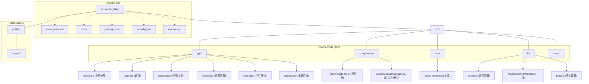

# Yi Learning Blog 项目架构图

下面是使用 Mermaid.js 语法描述的项目架构图，展示了主要组件之间的关系。

## 图例说明

- 实线连接 (`---`, `-->`) 表示强依赖关系或直接包含关系
- 虚线连接 (`-.->`) 表示配置或间接关系
- 方框 (`[]`) 表示主要组件或目录
- 子图 (`subgraph`) 用于对相关组件进行分组

## 查看方式

此图表使用 Mermaid.js 语法编写。要查看渲染后的图表，可以：

1. 使用支持 Mermaid 的 Markdown 查看器（如 GitHub, GitLab, VS Code + 插件）
2. 访问 [Mermaid Live Editor](https://mermaid.live/)，粘贴上述代码
3. 使用 Mermaid CLI 工具将其转换为图片文件

## 项目架构说明

### 核心结构

- **`src/`**: 包含所有源代码文件
  - **`app/`**: Next.js App Router 的核心目录，遵循 Next.js 14 的文件系统路由约定
  - **`components/`**: 可复用的 React 组件，如主题切换器、自定义光标管理器等
  - **`data/posts/`**: 存储博客文章的 Markdown 文件
  - **`lib/`**: 实用工具和配置，如站点配置、Markdown 处理、字体设置等
  - **`types/`**: TypeScript 类型定义

- **`public/`**: 静态资源目录，包含自定义光标等资源
- **`.next/`**: Next.js 构建输出目录（自动生成）
- **`node_modules/`**: 项目依赖包（由 npm/yarn 管理）

### 技术栈

- Next.js 14 (React 框架)
- TypeScript
- Tailwind CSS
- Markdown 处理：使用 gray-matter、remark、rehype 相关库

### 数据流

1. 用户请求 → Next.js App Router (`src/app/`) → 对应路由的页面组件
2. 博客文章: `src/app/posts/[slug]/page.tsx` → `src/lib/markdown.ts` 读取和解析 `src/data/posts/*.md` → 渲染页面

## 注意事项

- 在项目根目录下有 `aiblog/aiblog/` 的嵌套结构，可能是遗留/冗余代码，建议检查并清理
- 确保所有代码和内容都集中在 `src/` 目录下，以保持项目结构清晰 