# Yi Learning Blog

一个非科班妈妈的AI学习博客，分享从零开始的学习路径、项目实践与资源收集。

## 技术栈

- **[Next.js](https://nextjs.org/)** - React框架，支持静态生成（SSG）
- **[Tailwind CSS](https://tailwindcss.com/)** - 用于样式设计，自定义暗黑主题
- **[Markdown](https://www.markdownguide.org/)** - 博客内容格式

## 特性

### 基础功能
- ✅ 基于Next.js的静态生成（SSG），提高网站性能和SEO
- ✅ Markdown文章支持，自动渲染标题、目录、代码高亮
- ✅ 美观的暗色主题设计，带有mint green强调色
- ✅ 响应式布局，适配移动端和桌面端
- ✅ 博客文章搜索功能
- ✅ 文章标签系统与标签筛选
- ✅ 自定义Logo支持
- ✅ 社交媒体链接
- ✅ 文章目录自动生成
- ✅ 可配置的站点信息

### SEO优化
- ✅ 动态Sitemap和Robots.txt
- ✅ 结构化数据（BlogPosting Schema）
- ✅ 面包屑导航（Breadcrumb Schema）
- ✅ 作者信息Schema标记
- ✅ FAQ结构化数据支持
- ✅ Open Graph和Twitter Cards
- ✅ 完整的元数据优化

### 性能与监控
- ✅ 图片优化（WebP/AVIF）
- ✅ CDN支持和自定义加载器
- ✅ 实时性能监控（Core Web Vitals）
- ✅ 自动化SEO检查工具
- ✅ 性能审计脚本
- ✅ 图片验证和优化建议

### 分析与追踪
- ✅ Google Analytics集成
- ✅ 自定义事件追踪
- ✅ 性能指标收集
- ✅ 用户行为分析

## 项目架构

本项目是一个基于 Next.js 和 Tailwind CSS 构建的博客。

```
src/
├── app/                 # Next.js App Router 核心目录
│   ├── globals.css      # 全局CSS样式，影响整个应用
│   ├── layout.tsx       # 全局布局组件，包裹所有页面
│   ├── page.tsx         # 网站首页 (对应 "/")
│   ├── posts/[slug]/    # 动态路由，用于显示单篇博客文章
│   ├── resources/       # "资源" 页面的路由和组件
│   └── roadmap/         # "学习路线" 页面的路由和组件
├── components/          # 可复用的React组件 (例如：按钮, 卡片, 导航栏)
├── data/
│   └── posts/           # 存放Markdown格式的博客文章 (.md 文件)
├── lib/
│   ├── config.ts        # 站点配置文件 (如标题, 描述, 社交链接)
│   └── markdown.ts      # Markdown处理相关的工具函数 (如读取、解析)
└── types/               # TypeScript类型定义
public/                  # 静态资源目录 (图片, 字体, 图标等)
├── cursors/             # (推测) 自定义光标文件
.next/                   # Next.js 构建输出和缓存目录 (自动生成, 请勿手动修改)
node_modules/            # 项目依赖包 (自动生成, 由npm/yarn管理)
aiblog/                  # (注意) 存在一个嵌套的 aiblog/aiblog/ 结构，可能需要检查和清理冗余
package.json             # 项目元数据，依赖列表和脚本命令
tailwind.config.js       # Tailwind CSS 配置文件
postcss.config.js        # PostCSS 配置文件
tsconfig.json            # TypeScript 配置文件
next-env.d.ts            # Next.js 自动生成的TypeScript类型声明
readme.md                # 本文件，项目说明和指南
prd.md                   # (推测) 产品需求文档
.gitignore               # 指定Git忽略的文件和目录
.cursorindexingignore    # Cursor IDE 的索引忽略配置
.specstory/              # (推测) 测试或开发工具相关目录
```

**架构图 (Mermaid.js):**

```mermaid
graph TD
    subgraph "Project Root"
        A["aiblog (Next.js App)"]
        NM["node_modules/"]
        NEXT_DIR[".next/"]
        PKG_JSON["package.json"]
        TSCONFIG["tsconfig.json"]
        README["readme.md"]
    end

    subgraph "Source Code (src/)"
        SRC_APP["app/"]
        SRC_COMPONENTS["components/"]
        SRC_DATA["data/"]
        SRC_LIB["lib/"]
        SRC_TYPES["types/"]
    end

    subgraph "Public Assets (public/)"
        PUBLIC_CURSORS["cursors/"]
        PUBLIC_IMAGES["images/ (example)"]
    end

    A --- SRC_APP
    A --- SRC_COMPONENTS
    A --- SRC_DATA
    A --- SRC_LIB
    A --- SRC_TYPES
    A --- PUBLIC_CURSORS
    A --- PUBLIC_IMAGES

    SRC_APP --> LAYOUT["layout.tsx (Global Layout)"]
    SRC_APP --> PAGE_HOME["page.tsx (Homepage)"]
    SRC_APP --> PAGE_POSTS["posts/[slug] (Blog Posts)"]
    SRC_APP --> PAGE_RESOURCES["resources/"]
    SRC_APP --> PAGE_ROADMAP["roadmap/"]

    SRC_DATA --> DATA_POSTS["posts/ (Markdown Files)"]
    SRC_LIB --> LIB_CONFIG["config.ts (Site Config)"]
    SRC_LIB --> LIB_MARKDOWN["markdown.ts (Markdown Utilities)"]

    A -.-> PKG_JSON
    A -.-> TSCONFIG
    A -.-> NEXT_DIR
    A -.-> NM
    A -.-> README
```


**注意:** `aiblog/aiblog/` 目录结构存在潜在冗余，建议检查并确认 `src/` 是否为唯一的代码和数据源。以上结构图主要基于 `src/` 目录。

## 本地开发

1. 克隆仓库
```bash
git clone https://github.com/yourusername/yi-learning-blog.git
cd yi-learning-blog
```

2. 安装依赖
```bash
npm install
```

3. 启动开发服务器
```bash
npm run dev
```

4. 在浏览器中访问 `http://localhost:3000`

## 自定义

可以通过修改 `src/lib/config.ts` 文件来自定义站点信息：

- 站点标题和描述
- 社交媒体链接
- 导航菜单
- Logo配置
- 版权信息

## 添加新文章

在 `src/data/posts/` 目录中创建新的 `.md` 文件，并添加以下frontmatter:

```markdown
---
title: '文章标题'
date: '2023-10-10'
summary: '文章摘要'
tags: ['标签1', '标签2']
# coverImage: '/images/posts/your-cover-image.jpg'  # 已移除封面图功能
---

文章内容...
```

### ~~封面图片管理~~ (已移除)

~~封面图功能已移除，博客现在使用简洁的无图片卡片设计。~~

## SEO和性能优化

### 环境变量配置

创建 `.env.local` 文件并配置以下变量：

```bash
# Google Analytics
NEXT_PUBLIC_GA_ID=G-XXXXXXXXXX

# Site URL (生产环境)
NEXT_PUBLIC_SITE_URL=https://yourdomain.com

# Search Console验证码
NEXT_PUBLIC_GOOGLE_VERIFICATION=your-google-verification-code
```

### SEO功能

- **动态Sitemap**：自动生成sitemap.xml
- **Robots.txt**：搜索引擎爬虫指南
- **结构化数据**：Schema.org标记用于文章
- **Open Graph**：社交媒体分享优化
- **元数据优化**：页面标题、描述、关键词

### 性能优化

- **图片优化**：WebP/AVIF格式支持
- **CDN支持**：可配置CDN加速
- **缓存策略**：静态资源长期缓存
- **代码分割**：Next.js自动代码分割
- **CSS优化**：实验性CSS优化
- **性能监控**：Core Web Vitals实时追踪

## 开发脚本

```bash
# 开发服务器
npm run dev

# 构建项目
npm run build

# 启动生产服务器
npm start

# 运行SEO检查
npm run seo:check

# 构建前SEO验证
npm run seo:build

# 性能审计
npm run perf:audit

# 图片验证
npm run validate:images

# 完整优化构建
npm run optimize:build
```

## 高级功能

### 面包屑导航
自动生成的面包屑导航，支持结构化数据：

```tsx
import Breadcrumb from '../components/Breadcrumb';

const breadcrumbItems = [
  { name: '文章', href: '/posts' },
  { name: '文章标题', href: '/posts/slug', current: true }
];

<Breadcrumb items={breadcrumbItems} />
```

### 作者信息Schema
支持丰富的作者信息结构化数据：

```tsx
import { AuthorCard } from '../components/AuthorSchema';

const authorInfo = {
  name: "Yi Learning",
  description: "专注AI学习分享的博主",
  jobTitle: "AI学习博主",
  sameAs: ["https://github.com/username"]
};

<AuthorCard author={authorInfo} />
```

### FAQ结构化数据
为常见问题添加Schema标记：

```tsx
import { FAQSection } from '../components/FAQSchema';

const faqs = [
  {
    question: "如何开始学习AI？",
    answer: "建议从Python基础开始..."
  }
];

<FAQSection faqs={faqs} />
```

### 性能监控
自动收集Core Web Vitals指标：
- First Contentful Paint (FCP)
- Largest Contentful Paint (LCP)  
- First Input Delay (FID)
- Cumulative Layout Shift (CLS)

### CDN配置
设置环境变量启用CDN加速：

```env
CDN_URL=https://cdn.yourdomain.com
```

## 部署

该博客可以部署到任何支持Next.js的平台，如Vercel、Netlify或GitHub Pages。

1. 构建静态网站
```bash
npm run build
```

2. 部署到Vercel (推荐)
```bash
npx vercel --prod
```

## 维护指南

本指南旨在帮助开发者理解项目结构、进行日常维护和功能扩展。

### 1. 关键目录和文件职责

*   **`src/app/`**: Next.js App Router 的核心。
    *   `layout.tsx`: 定义全局页面结构和共享UI元素（如导航栏、页脚）。
    *   `page.tsx` (各级子目录中): 定义对应路由的页面内容。
    *   `globals.css`: 全局样式，应谨慎修改以避免意外影响。
*   **`src/components/`**: 存放可复用的React组件。鼓励将UI拆分为小型、独立的组件。
*   **`src/data/posts/`**: 博客文章的Markdown源文件。文章的元数据（标题、日期、标签等）在文件头部的frontmatter中定义。
*   **`src/lib/config.ts`**: 站点级别的配置，如网站标题、描述、作者信息、社交链接等。修改此文件可以快速定制站点信息。
*   **`src/lib/markdown.ts`**: 提供读取和处理Markdown文件的函数，例如获取文章列表、解析文章内容和元数据。
*   **`public/`**: 用于存放不需要构建处理的静态资源，如图片、favicon等。此目录下的文件会按原样部署到网站根目录。
*   **`package.json`**: 定义项目依赖和脚本命令（如`npm run dev`, `npm run build`）。

### 2. 依赖项更新与管理

*   **检查过时依赖**: 定期运行 `npm outdated` 查看可更新的依赖。
*   **更新依赖**:
    *   小版本和补丁版本更新通常较安全：`npm update`
    *   主版本更新可能包含破坏性变更，需谨慎处理，并查阅对应库的更新日志：`npm install package-name@latest`
*   **注意事项**: 更新依赖后，务必进行充分测试，确保应用功能正常。

### 3. 代码风格与规范 (待补充)

*   (建议) 本项目使用 [ESLint](https://eslint.org/) 和 [Prettier](https://prettier.io/) 来统一代码风格和进行静态检查。
*   (建议) 提交代码前，请运行 `npm run lint` 和 `npm run format` (如果配置了这些脚本)。

### 4. 测试 (待补充)

*   (建议) 项目应包含单元测试和/或集成测试，以确保代码质量和功能稳定性。
*   (建议) 测试框架可选用 [Jest](https://jestjs.io/) 和 [React Testing Library](https://testing-library.com/docs/react-testing-library/intro/)。
*   (建议) 运行测试的命令: `npm test` (如果配置了此脚本)。

### 5. 构建和部署

*   **构建**: `npm run build` 会生成生产环境的优化版本到 `.next` 目录。
*   **部署**: 参考上面的 "部署" 章节。部署前确保构建成功且无错误。

### 6. 故障排查 (Troubleshooting - 待补充)

*   **开发服务器启动失败**:
    *   检查端口是否被占用。
    *   检查 `node_modules` 是否完整，尝试删除 `node_modules` 和 `package-lock.json` 后重新运行 `npm install`。
*   **构建失败**:
    *   仔细阅读构建日志中的错误信息。
    *   常见原因包括类型错误 (TypeScript)、依赖问题或代码错误。

### 7. 贡献指南 (待补充)

*   (建议) 如果希望接受外部贡献，可以创建一个 `CONTRIBUTING.md` 文件，详细说明贡献流程，如：
    *   如何报告 Bug (Issue模板)。
    *   如何提交功能请求 (Issue模板)。
    *   代码提交流程 (Fork -> Create Branch -> Commit -> Pull Request)。
    *   代码风格要求。

### 8. 版本控制策略 (待补充)

*   (建议) 采用 [Semantic Versioning (语义化版本控制)](https://semver.org/lang/zh-CN/)。
*   (建议) 使用 Git 分支进行功能开发和 Bug 修复 (例如 Gitflow 或简化的 GitHub flow)。

### 9. 项目结构清理建议

*   目前项目中观察到 `aiblog/aiblog/` 这样的嵌套目录，以及可能与 `src/` 下对应目录功能重叠的情况 (如 `aiblog/aiblog/data/posts/` vs `src/data/posts/`)。
*   **强烈建议**：检查并清理这些潜在的冗余结构，确保 `src/` 目录是主要且唯一的开发代码和核心数据来源，以避免混淆和维护困难。

## 许可证

MIT