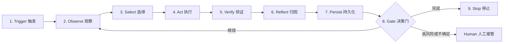

# Loop Engineering 学习与实践指南

> 面向希望从 AI 编程初学者进阶到“可设计、运行和治理 Agent 循环”的开发者。  
> 资料核验日期：2026-06-28。

## 先说结论

**Loop Engineering（循环工程）不是新模型、新编程语言，也不是某个固定框架。**

它是一种正在形成中的 AI 软件工程方法：你不再亲自给 Coding Agent 逐轮发送下一条提示，而是设计一个小型控制系统，让系统持续完成下面的闭环：

```text
发现工作 -> 选择任务 -> 执行 -> 获取环境反馈 -> 验证 -> 记录状态
         -> 判断继续、停止还是交给人 -> 下一轮
```

一句话概括：

> Prompt Engineering 优化“一次怎么问”；Loop Engineering 设计“系统如何反复做、如何知道做对了、何时必须停”。

这个术语在 **2026 年 6 月**快速走红。Addy Osmani 于 2026 年 6 月 7 日发表的文章，将其定义为：把“亲自提示 Agent 的人”替换为“设计提示 Agent 的系统的人”。Peter Steinberger 和 Claude Code 负责人 Boris Cherny 的公开表达进一步推动了讨论。

需要保持清醒：截至 2026 年 6 月 28 日，它仍是一个新术语，没有正式标准。它所描述的工程思想并不全新，而是把已有的 Agent Loop、Ralph Loop、Evaluator-Optimizer、Harness Engineering、长期任务状态管理、自动化评估和 DevOps 控制面组合成了更高一层的工作方式。

## 目录

1. [为什么现在会出现 Loop Engineering](#为什么现在会出现-loop-engineering)
2. [它和其他概念有什么区别](#它和其他概念有什么区别)
3. [一个完整 Loop 的九个环节](#一个完整-loop-的九个环节)
4. [现代工具提供的五个组件加外部记忆](#现代工具提供的五个组件加外部记忆)
5. [什么任务适合做成 Loop](#什么任务适合做成-loop)
6. [从零实现第一个 Loop](#从零实现第一个-loop)
7. [成熟度模型](#成熟度模型)
8. [最佳实践](#最佳实践)
9. [常见失败模式](#常见失败模式)
10. [30 天学习路线](#30-天学习路线)
11. [四个进阶练习项目](#四个进阶练习项目)
12. [能力地图与验收标准](#能力地图与验收标准)
13. [可操作资料库：教程、文章、帖子与实践库](#可操作资料库教程文章帖子与实践库)
14. [推荐资料](#推荐资料)

---

## 为什么现在会出现 Loop Engineering

### 1. Coding Agent 已经从“回答问题”变成“操作环境”

现代 Coding Agent 可以读取仓库、搜索代码、编辑文件、运行命令、调用浏览器、读取 CI、创建分支和 PR。模型不再只产生文本，而是在真实环境中反复执行“观察、思考、行动”。

### 2. 单次 Prompt 不再是主要瓶颈

当任务持续几小时或几天时，真正困难的是：

- 下一轮怎样知道上一轮做了什么；
- 怎样从大量候选任务中选择下一件事；
- 怎样判断“代码写完”和“需求真的完成”的区别；
- 多个 Agent 怎样避免修改同一份工作区；
- 失败后怎样恢复，而不是不断把错误放大；
- 怎样控制权限、成本、运行时间和风险。

这些问题靠一条更长的 Prompt 解决不了，它们属于系统设计问题。

### 3. 产品开始原生提供循环所需组件

Codex、Claude Code 等工具已经逐步提供目标模式、定时任务、Skills、MCP、Hooks、Subagents 和 Worktrees。过去需要自行拼接的 Bash 脚本，现在可以用产品原语组合。因此，关注点从“选择哪个 Agent”转向“设计什么样的闭环”。

### 4. 软件天然具有可验证反馈

代码比很多知识工作更适合闭环，因为它有大量可执行的外部反馈：

- 编译是否成功；
- 单元测试、集成测试是否通过；
- 类型检查、Lint 是否干净；
- 性能指标是否改善；
- 页面在浏览器中是否真的可用；
- CI、监控和错误日志是否符合预期。

Agent 可以依据这些反馈调整下一步，而不是仅凭语言上的“我认为已经完成”。

---

## 它和其他概念有什么区别

| 概念 | 主要优化对象 | 典型问题 | 产物 |
|---|---|---|---|
| Prompt Engineering | 单次模型请求 | 这一轮怎么说得更清楚？ | Prompt 模板 |
| Context Engineering | 模型当前看到的信息 | 这一轮应该给它哪些上下文？ | 检索、压缩、上下文装配 |
| Agent Engineering | 能使用工具并自主决策的执行体 | Agent 如何观察、规划、调用工具？ | Agent 与工具接口 |
| Harness Engineering | 单次或单个 Agent 运行环境 | 如何约束、辅助、观察一次 Agent 执行？ | 沙箱、Hooks、工具、日志、上下文策略 |
| Spec-driven Development | 可执行或可验收的需求 | 到底要做什么，怎样算完成？ | Spec、任务清单、验收标准 |
| Loop Engineering | 跨轮次、跨 Agent、跨时间的控制系统 | 谁触发、做什么、如何验证、记住什么、何时停止？ | 可持续运行的闭环 |

### Loop Engineering 与 Agent Loop

Agent Loop 通常指单个 Agent 内部的：

```text
模型推理 -> 调用工具 -> 读取结果 -> 再推理
```

Loop Engineering 关注更外层的控制面：

```text
何时启动 Agent -> 给它哪个任务 -> 放在哪个隔离环境 ->
由谁验证 -> 状态写到哪里 -> 是否继续或升级给人
```

### Loop Engineering 与 Ralph Loop

Ralph Loop 是 Loop Engineering 的重要前身和一种具体模式。其核心是用很简单的外层循环反复启动 Coding Agent，让 Agent 每轮读取同一份目标和持久状态，完成一个小增量后退出，再以新上下文开始下一轮。

Ralph 的价值不在“无限 while 循环”，而在这些思想：

- 需求先被拆成可完成的小项；
- 每一轮只推进有限工作；
- 进展写回仓库或状态文件；
- 新一轮使用干净上下文；
- 通过测试和真实环境反馈决定是否完成。

### Loop Engineering 与 Harness Engineering

可以把 Harness 理解成 Agent 的工作台，把 Loop 理解成工作台之上的调度和控制系统：

```text
模型 < Agent < Harness < Loop < 人类与组织治理
```

这个层级不是正式标准，但有助于定位问题。工具调用不可靠，通常是 Agent/ACI 问题；一次执行缺少沙箱和日志，是 Harness 问题；跨轮次重复、失控或不知道何时停止，是 Loop 问题。

---

## 一个完整 Loop 的九个环节



### 1. Trigger：为什么开始这一轮

触发方式包括：人工启动、定时任务、GitHub 事件、CI 失败、监控报警、新 Issue、依赖更新或上一轮主动安排的后续任务。

好的触发器必须去重，并明确运行频率。每 5 分钟重复处理同一故障不是自动化，而是成本放大器。

### 2. Observe：读取环境真相

常见输入包括：

- Git 状态、最近提交和当前分支；
- 需求、Issue、PR 评论和 CI 状态；
- `STATE.md`、任务清单和上轮运行日志；
- 测试结果、监控数据、性能基线；
- 项目规则、Skills、`AGENTS.md` 或 `CLAUDE.md`。

这里的原则是：**以环境结果作为 Ground Truth，而不是相信 Agent 自己的叙述。**

### 3. Select：决定本轮只做什么

选择器可以是固定规则，也可以由模型决策。初学阶段优先使用确定性规则，例如：

1. 先修复破损的基础测试；
2. 再选择最高优先级的未完成任务；
3. 每轮只处理一个可验证增量；
4. 遇到高风险目录立即交给人。

### 4. Act：在受控环境中执行

执行者可以是一个 Agent，也可以是 Orchestrator + Workers。执行环境应限制可修改路径、网络访问、工具权限和最长运行时间；并行写操作应使用独立 Worktree、容器或沙箱。

### 5. Verify：独立证明结果

验证应尽量由确定性程序完成：

```text
编译器 > 测试 > Schema/静态检查 > 浏览器 E2E > 指标比较 > LLM 评审 > 自我声明
```

不是所有任务都能完全程序化验证。主观任务可以使用 Rubric + 独立 Reviewer Agent + 抽样人工复核，但不要让实现者的自我评价成为唯一证据。

### 6. Reflect：把失败变成下一轮可用的信息

反思不是让模型写一篇感想，而是输出结构化诊断：

- 哪个验收项失败；
- 证据是什么；
- 可能原因；
- 已尝试过哪些方法；
- 下一轮推荐尝试什么；
- 是否触发停止或升级条件。

### 7. Persist：把状态放到会留下来的地方

上下文窗口不是可靠记忆。长期状态应存放在 Git、数据库、Issue Tracker 或结构化文件中。

最小状态至少包括：

- 当前目标及验收标准；
- 已完成和未完成任务；
- 最近一次验证结果；
- 尝试历史和失败原因；
- 本轮成本、耗时和修改范围；
- 下一步建议与人工决策记录。

### 8. Gate：决定继续、完成、回滚或交给人

Gate 应优先由代码和规则执行，而不是完全交给模型。例如：

```text
所有 required checks 通过 AND 变更不包含迁移/支付/权限目录
    -> 可以创建 PR
存在安全相关修改 OR 连续失败 3 次 OR 预算超过上限
    -> 停止并交给人
验收项未完成 AND 仍有预算
    -> 开始下一轮
```

### 9. Stop：停止是功能，不是意外

每个 Loop 都必须定义：

- 成功停止条件；
- 最大轮数；
- 最大时间；
- 最大 Token 或金额；
- 连续无进展次数；
- 连续相同错误次数；
- 人工 Kill Switch；
- 哪些情况必须失败关闭（fail closed）。

---

## 现代工具提供的五个组件加外部记忆

Addy Osmani 将现代 Loop 所需能力归纳为五类组件，再加一个外部记忆层。

| 组件 | 在循环里的作用 | 初学者的最小实现 |
|---|---|---|
| Automations / Scheduling | 定时或事件触发 | cron、GitHub Actions、产品内 Automation |
| Worktrees / Isolation | 隔离并行修改 | 每个任务一个 Git Worktree 或容器 |
| Skills / Instructions | 固化重复知识与流程 | `AGENTS.md`、`CLAUDE.md`、`SKILL.md` |
| Plugins / Connectors | 连接 GitHub、Linear、Sentry、浏览器等 | CLI、API 或最小权限 MCP |
| Subagents | 拆分探索、实现、验证职责 | Maker + Checker 两角色 |
| Memory / State | 跨会话保留事实 | `STATE.md`、JSON 任务表、Git 历史 |

这六项是产品能力视角。站在系统设计视角，还必须补上四项：

- **Specification**：明确目标、约束、验收标准；
- **Evaluation**：用测试和指标衡量质量；
- **Observability**：记录每轮输入、动作、结果、成本和原因；
- **Governance**：权限、审批、审计、停止和责任边界。

没有后四项的 Loop 通常只是“自动重复调用模型”。

---

## 什么任务适合做成 Loop

用下面五个问题判断：

1. **任务是否重复发生？** 一次性的模糊需求先用对话解决。
2. **输入是否可获取？** Agent 能否稳定读取所需代码、状态和外部系统？
3. **成功是否可验证？** 是否存在测试、指标、Rubric 或明确状态？
4. **错误是否可恢复？** 是否能在分支、沙箱或可回滚环境中试错？
5. **失败的影响是否可接受？** 不可逆、高合规风险操作不适合直接无人值守。

### 很适合

- 每日 Issue/日志/CI 分类和报告；
- PR 状态跟踪、评论汇总、修复建议；
- 依赖更新候选分析；
- Lint、类型和小范围测试修复；
- 固定指标下的性能或参数实验；
- 文档一致性检查、变更日志草稿；
- 有完整测试集的小型重构。

### 谨慎使用

- 跨多个核心系统的大型迁移；
- 验收标准高度主观的产品设计；
- 会处理生产数据、用户隐私或密钥的流程；
- 自动发布、自动合并或自动数据库迁移；
- 需求本身尚未达成共识的项目；
- 无测试、无版本控制、无法回滚的遗留系统。

---

## 从零实现第一个 Loop

初学者不要从“让 Agent 通宵自动写完整产品”开始。第一个 Loop 应当是：**只读、只报告、低频、低成本、可人工核验。**

### 示例：每日仓库健康检查

目标：每天读取 CI、未解决 Issue 和最近提交，生成一份健康报告，不修改代码。

#### 第一步：写可验证目标

```text
每天 09:00 检查仓库：
1. 汇总过去 24 小时失败的 CI；
2. 列出新建且尚未分类的 Issue；
3. 标记最近提交中缺少测试的高风险改动；
4. 写入 reports/YYYY-MM-DD.md；
5. 如果没有发现问题，明确记录“无发现”；
6. 禁止修改源码、关闭 Issue、重跑部署或向外部发送消息。
```

#### 第二步：先手动运行三次

不要立刻定时。先在普通 Agent 会话中运行同一任务三次，观察：

- 是否总能找到正确仓库和时间范围；
- 是否重复报告同一问题；
- 是否把正常情况当故障；
- 是否需要额外工具或项目说明；
- 输出是否足以让人做决定。

#### 第三步：把稳定知识移出 Prompt

将仓库结构、CI 名称、风险目录、忽略项和报告格式写入项目说明或 Skill。自动化 Prompt 只保留触发意图，例如：

```text
运行仓库健康检查 Skill。遵循只读策略，更新当天报告；没有发现也要记录。
```

#### 第四步：加入状态和去重

在 `STATE.md` 中记录上次检查时间、已报告事件 ID 和未解决项。新一轮必须先读取状态，避免每次从零开始。

#### 第五步：加入预算和停止条件

```yaml
max_runtime_minutes: 10
max_agent_turns: 8
max_external_requests: 30
on_auth_failure: stop
on_repeated_error: stop_after_2
write_scope: reports/**, STATE.md
```

#### 第六步：运行一周后再升级

只有当报告准确、成本稳定、没有越权行为后，才允许 L2 行为，例如：在独立 Worktree 中生成修复补丁，但仍不自动提交或合并。

本仓库附带可复制模板：

- [`templates/LOOP.md`](templates/LOOP.md)：循环契约；
- [`templates/STATE.md`](templates/STATE.md)：跨轮状态；
- [`templates/EVALS.md`](templates/EVALS.md)：评估设计；
- [`templates/RUN_LOG.md`](templates/RUN_LOG.md)：运行记录。

---

## 成熟度模型

### L0：人工对话

人负责每轮观察和下指令，Agent 只执行当前任务。

**毕业条件：** 能稳定写出 Goal、Context、Constraints、Done When；能要求 Agent 运行测试并审查 Diff。

### L1：Report-only Loop

Loop 能自动发现问题并生成报告，但无权修改代码或外部状态。

**毕业条件：** 连续一周运行稳定；报告可复核；去重有效；成本可预测；没有越权。

### L2：Human-approved Action

Loop 可以在隔离环境生成 Patch、分支或 PR 草稿，所有有副作用的操作需要人工批准。

**毕业条件：** 大多数 Patch 能通过测试；回滚可靠；人工能从日志快速理解变更原因。

### L3：Bounded Autonomy

在明确白名单内，Loop 可以自主完成低风险动作，例如修复格式、更新快照、创建 PR；合并、发布和高风险修改仍需人工审批。

**毕业条件：** 有成体系的 Evals、权限策略、预算、告警、审计和事故处理流程。

### L4：Multi-loop System

多个 Loop 分工协作，例如 Triage、Implement、Review、CI Recovery、Release Notes，并具有任务租约、冲突检测和统一状态面。

**毕业条件：** 组织能回答每个 Loop 的负责人、权限、SLO、成本、失败影响和停机方式。

### L5：Self-improving Loop

Loop 会根据失败样本提出 Prompt、Skill、工具或策略改进，并通过离线 Evals 和对照实验验证后再发布。

**注意：** 自我改进不等于允许 Agent 直接修改自己的评估、权限和部署策略。控制面必须独立，并保留人工批准。

---

## 最佳实践

### 1. 先优化任务定义，再优化 Prompt

一个合格任务应包含四部分：

```text
Goal：要改变什么
Context：事实和输入在哪里
Constraints：禁止什么、边界是什么
Done When：哪些证据同时成立才算完成
```

“优化首页”不是 Loop 目标；“在固定设备配置下把首页 P75 LCP 从 2.4 秒降到 1.8 秒以下，功能测试保持通过”才是。

### 2. 让验证基于结果，而不是文字

Agent 说“完成了”只是一个待验证声明。检查最终环境状态：数据库记录、Git Diff、浏览器行为、测试结果、监控指标或外部系统状态。

### 3. 优先使用确定性验证器

编译器、测试和规则引擎便宜、稳定、可复现。LLM Reviewer 更适合检查架构一致性、遗漏和主观质量，但不应替代已有的确定性检查。

### 4. 分离 Maker 和 Checker

实现者容易为自己的方案辩护。让独立上下文中的 Reviewer 根据原始 Spec 和实际 Diff 检查结果。高风险任务可使用多个专门 Reviewer：测试、安全、性能、可维护性。

### 5. 每轮只交付一个可验证增量

长期 Agent 常见失败是试图一次完成全部功能，在上下文耗尽时留下半成品。每轮应选择一个任务、完成它、验证它、记录它，再进入下一轮。

### 6. 将长期状态外部化

把事实写入结构化文件、Issue Tracker 或数据库。状态文件应短小、可机器更新、可审计；长篇聊天摘要不是理想状态存储。

### 7. 使用新鲜上下文，但保留持久状态

无限延长同一会话会造成 Context Pollution 和 Context Rot。适合的做法是：新一轮使用干净上下文，先读取 Spec、Git 历史、状态和最近验证证据。

### 8. 并行只用于真正独立的任务

适合并行：代码探索、日志分析、测试运行、不同维度的 Review。谨慎并行：多个 Agent 同时修改共享核心文件。所有并行写任务都应隔离，并由主控协调合并。

### 9. 从最小权限开始

权限按能力拆分：读代码、写工作区、访问网络、创建 PR、修改 Issue、部署生产不应被视为同一个开关。MCP 和插件遵循最小 Scope；本地 MCP Server 等同于运行本地代码，必须审查来源和启动命令。

### 10. 只读 -> 建议 -> Patch -> PR -> 合并，逐级开放

不要从报告系统直接跳到自动合并。每提升一级自治，都应有一段观察期和明确晋级指标。

### 11. 为成本设置工程预算

至少记录：模型、输入/输出 Token、Agent 数量、轮数、外部请求、运行时间和最终结果。衡量“每个成功结果的成本”，而不是只看单轮价格。

### 12. 防止无进展循环

检测这些信号：

- 连续多轮 Diff 为空；
- 同一测试以同一错误失败；
- 修改和回滚同一文件；
- 验证指标没有改善；
- 状态记录重复；
- Agent 不断扩大任务范围。

触发后应更换策略、缩小任务、回到最近成功点或交给人，而不是机械重试。

### 13. 让每轮可重放、尽量幂等

同一事件重复触发不应创建多个重复 PR、重复评论或重复迁移。为事件、任务和运行分配唯一 ID，写操作前检查是否已处理。

### 14. 保存 Trace，而不只保存最终回答

至少保留：触发原因、输入版本、选择理由、工具调用、修改摘要、验证结果、成本、停止原因。出现事故时，必须能回答“系统为何做了这个决定”。

### 15. 用真实失败构建 Evals

从历史 Bug、误报、越权、错误工具调用和人工否决样本建立评估集。一个任务运行多次，因为模型输出有随机性；不要用单次成功证明可靠性。

### 16. 评估 Loop，而不只是评估模型

最终质量来自模型、Prompt、工具、权限、上下文、状态、调度和验证器的组合。换模型后要重跑 Evals；改 Skill、工具描述或 Harness 也一样。

### 17. 高风险动作保留人工决策门

下列动作默认需要人工确认：生产发布、数据库迁移、权限变更、支付、删除数据、处理密钥、修改安全策略、自动合并核心代码。

### 18. 定期做 Loop Retrospective

每周检查：哪些任务真正节省了时间、哪些结果总被否决、哪里消耗最多 Token、哪些规则应进入 Skill、哪些 Loop 应降低频率或直接关闭。

---

## 常见失败模式

| 反模式 | 为什么失败 | 改进方式 |
|---|---|---|
| `while true` + 一个大 Prompt | 没有任务边界、预算和停止条件 | 显式状态机、最大轮数、成功/失败出口 |
| Agent 自己实现、自己宣布通过 | 自我确认偏差 | 独立 Checker + 确定性测试 |
| Agent 可以修改验收测试 | 容易通过“降低标准”获胜 | 评估面只读，由控制面维护 |
| 每轮重新读完整仓库 | 贵且噪声大 | 代码地图、定向检索、Skills、增量状态 |
| 把聊天记录当数据库 | 压缩和上下文窗口会丢信息 | 外部结构化状态 |
| 一个循环同时做十类事情 | 难调试、难授权、难评估 | 单一职责 Loop，必要时再编排 |
| 一开始就上多 Agent | 协调成本超过收益 | 先让单 Agent Loop 稳定，再增加角色 |
| 多 Agent 共用工作目录 | 文件冲突和状态污染 | Worktree、容器、任务租约 |
| 无日志的自动修复 | 失败时无法归因 | 完整 Run Log 和 Trace ID |
| 所有 MCP 都给全权限 | 提示注入或工具失误扩大影响 | Scope 白名单、审批、沙箱、审计 |
| 自动重试所有错误 | 认证、逻辑错误会无限烧钱 | 按错误分类，瞬时错误才退避重试 |
| 用更多 Token 掩盖不清晰需求 | 产生更多不确定修改 | 先完善 Spec 和验收标准 |
| 只看测试是否绿 | 可能测试不足或行为错误 | E2E、Diff Review、指标和人工抽查 |
| Loop 自动改自己的控制面 | 可绕过权限和评分 | 控制面与执行面分离，变更需审批 |
| 追求“无人值守”作为 KPI | 自治时间不等于价值 | 看成功率、人工返工率、成本和风险 |

---

## 30 天学习路线

### 第 1 周：掌握单 Agent 工程基本功

目标：能让 Coding Agent 完成一个边界清晰、可验证的小任务。

学习：

- Git 分支、Commit、Diff、Revert、Worktree；
- Shell、项目构建、测试、Lint、类型检查；
- Coding Agent 的工具调用和权限模型；
- Goal / Context / Constraints / Done When；
- `AGENTS.md` 或 `CLAUDE.md` 的作用。

实践：

1. 选择一个有测试的小仓库；
2. 让 Agent 解释运行方式，不修改代码；
3. 让 Agent 修复一个小 Bug 并补测试；
4. 要求它运行验证并审查自己的 Diff；
5. 人工检查每一行修改。

验收：你能区分“Agent 的描述”和“环境中的证据”，并能在 5 分钟内判断一次修改是否可信。

### 第 2 周：构建状态化单循环

目标：把一个任务拆成多轮，每轮可恢复。

学习：

- 状态机、幂等、重试和停止条件；
- Ralph 模式与新鲜上下文；
- 结构化任务清单和进度文件；
- Git 历史作为恢复机制。

实践：

1. 用 [`templates/LOOP.md`](templates/LOOP.md) 定义循环；
2. 用 JSON 或 Markdown 建 10 项任务清单；
3. 每轮只允许完成一项；
4. 每轮结束更新状态和验证证据；
5. 手动重新启动 Agent，确认能从状态恢复。

验收：中断任意一轮后，新会话可以在不猜测的情况下继续工作。

### 第 3 周：加入独立验证、评估和安全边界

目标：让“完成”成为可度量结论。

学习：

- Evaluator-Optimizer；
- Code-based、Model-based、Human Grader；
- 多 Trial、成功率、误报率和成本指标；
- 沙箱、最小权限、MCP 安全；
- Maker / Checker 分离。

实践：

1. 从 10 个真实历史任务构建 Eval Set；
2. 为每项写确定性检查和 Reviewer Rubric；
3. 同一任务运行 3 次；
4. 记录成功率、平均轮数、成本和人工否决原因；
5. 加入连续失败、预算和风险停止条件。

验收：你能用数据比较两个 Loop 版本，而不是凭“感觉更聪明”。

### 第 4 周：调度、连接器、并行和运营

目标：上线一个 L1 或 L2 的真实 Loop。

学习：

- Automation、cron、GitHub Actions 或事件触发；
- Worktree 和并发控制；
- Skills、Hooks、MCP 与外部系统；
- Trace、Dashboard、告警和事故复盘；
- 渐进式权限开放。

实践：

1. 选择每日 Triage、PR Babysitter 或 Changelog Draft；
2. 先运行一周 Report-only；
3. 配置唯一 Run ID、去重、超时和成本上限；
4. 只在独立 Worktree 生成 Patch；
5. 建立每周 Retrospective。

验收：Loop 有明确 Owner、Runbook、Kill Switch、成本报表和人工接管路径。

---

## 四个进阶练习项目

### 项目 1：Daily Triage Loop

**难度：** 入门。  
**输入：** CI、Issue、最近 Commit。  
**输出：** 去重后的每日报告。  
**权限：** 只读。  
**核心能力：** 触发、观察、选择、外部状态、成本控制。

进阶：给每条发现附证据链接、置信度和建议 Owner；统计一周误报率。

### 项目 2：PR Babysitter

**难度：** 中级。  
**输入：** 指定 PR 的 CI、Review 评论和合并状态。  
**输出：** 状态摘要；在批准后修复明确反馈。  
**权限：** 读 PR，写独立 Worktree，禁止合并。  
**核心能力：** Thread Heartbeat、幂等、事件去重、Maker/Checker。

停止条件：PR 已合并/关闭、连续两次认证失败、评论存在歧义、修改触及高风险目录。

### 项目 3：Bounded Bug-fix Loop

**难度：** 中高级。  
**输入：** 一个可复现 Issue。  
**输出：** 带测试的 PR 草稿。  
**核心能力：** Spec、增量执行、独立验证、浏览器 E2E、Worktree。

约束：最多 5 轮；只能修改白名单目录；原始失败测试不可删除；Reviewer 不读取 Maker 的解释，只读取 Spec、Diff 和测试结果。

### 项目 4：Metric-driven Autoresearch Loop

**难度：** 高级。  
**输入：** 固定代码范围、固定时间预算、不可修改的评估器。  
**输出：** 实验日志和最佳 Commit。  
**核心能力：** 假设生成、实验、指标比较、保留/丢弃、分支恢复。

可参考 Karpathy `autoresearch` 的结构：固定评估函数和时间预算，Agent 每轮只修改允许文件；指标改善则保留，否则回退。不要在重要仓库中照搬其“永不停止”设定，生产 Loop 必须有预算和 Kill Switch。

---

## 能力地图与验收标准

当你能独立回答并实现下面的问题，才算从使用者进入 Loop Engineer：

### 任务设计

- 目标是否可判定，而不是开放式口号？
- 本轮任务粒度是否能在一个上下文内完成？
- 哪些约束是建议，哪些必须机械执行？

### 状态与恢复

- 新会话从哪里读取事实？
- 状态 Schema 是什么，谁可以修改？
- 进程中断、上下文耗尽、机器重启后怎样恢复？

### 验证与评估

- Ground Truth 在哪里？
- 哪些检查确定性执行，哪些需要 LLM 或人？
- 是否防止 Agent 修改评分器或测试来“作弊”？
- 同一任务多次运行的成功率和方差是多少？

### 工具与执行

- 工具描述是否清晰，参数是否不易误用？
- 并行任务是否真正独立？
- 写操作是否位于 Worktree、容器或沙箱？

### 安全与治理

- 默认权限是否最小？
- 哪些动作必须人工批准？
- 如何防提示注入、密钥泄露和恶意 MCP？
- 是否有审计日志、Owner、Runbook 和 Kill Switch？

### 运营与经济性

- 每次成功结果的平均成本是多少？
- Loop 的误报率、返工率和人工处理时间是多少？
- 连续无进展怎样检测？
- 什么时候应该降低频率、降级或关闭 Loop？

真正的进阶者不是能运行最多 Agent 的人，而是能以最低必要复杂度，持续产出可验证结果并控制失败影响的人。

---

## 可操作资料库：教程、文章、帖子与实践库

下面这组资料按“能帮助初学者真正做出第一个 Loop”的价值排序。阅读时不要追求一次看完，而是把每个资料转成一个可执行动作：写一份 Loop Contract、建一个状态文件、跑一次 report-only、加一个固定验证器、再逐步开放权限。

### 资料质量分级

| 等级 | 适合用途 | 判断标准 |
|---|---|---|
| A | 作为学习主线和实践起点 | 有明确工程结构、模板、检查清单或官方能力说明 |
| B | 补充理解和扩展案例 | 解释清楚，但需要自己判断哪些说法已过时或偏工具营销 |
| C | 观察社区分歧和风险 | 有真实讨论价值，但不能直接当作最佳实践 |
| D | 只做背景噪声 | 重复概念、缺少验证、强调“全自动”但不讲边界 |

### 核心资料库

| 资料 | 等级 | 最适合解决的问题 | 初学者应该怎么用 | 注意事项 |
|---|---:|---|---|---|
| [Addy Osmani: Loop Engineering](https://addyosmani.com/blog/loop-engineering/) | A | 建立概念边界：Loop 不是 Prompt，而是调度、隔离、知识、连接器、子 Agent 和外部状态的组合 | 先读“五个组件 + 外部记忆”和“风险”部分，然后把自己的项目映射到这六项：缺什么先补什么 | 这是术语源头之一，但不是正式标准；不要把示例工具等同于唯一实现 |
| [Cobus Greyling: Loop Engineering reference repository](https://github.com/cobusgreyling/loop-engineering) | A | 从概念走到可运行 pattern、starter、预算、审计和 run log | 从 `daily-triage` 或 `issue-triage` 开始；先复制 `LOOP.md`、`STATE.md`、`loop-budget.md`、`loop-run-log.md` 这类状态文件思想 | 社区库更新快，适合作为案例库；引入脚本前要审查代码和权限 |
| [Cobus Greyling: interactive guide and pattern picker](https://cobusgreyling.github.io/loop-engineering/) | A | 不知道第一个 Loop 应该选什么 | 用 pattern picker 选择低风险入口；优先选 Daily Triage、Changelog Drafter、Issue Triage | 不要一开始选 CI Sweeper 或 PR Babysitter 这类高频高成本 Loop |
| [OpenAI Codex Automations](https://developers.openai.com/codex/app/automations) | A | 理解 Codex 里如何把一次提示变成定时后台任务 | 学会把 recurring prompt 写成可维护的 automation，并让结果进入 triage，而不是直接修改生产状态 | 官方能力变化快，具体 UI 和配置以当前文档为准 |
| [OpenAI Codex Worktrees](https://developers.openai.com/codex/app/worktrees)、[Skills](https://developers.openai.com/codex/skills)、[Subagents](https://developers.openai.com/codex/subagents) | A | 建立隔离、项目知识和 maker-checker 分离 | 把“能不能并行写代码”先转成 worktree 问题；把重复说明写成 Skill；把 verifier 设为只读角色 | Subagent 会增加成本和复杂度，先用于 review、安全、测试这类高价值检查 |
| [Anthropic: Building effective agents](https://www.anthropic.com/engineering/building-effective-agents) | A | 理解 Workflow 与 Agent 的区别，以及何时不要过度自治 | 对照里面的 Prompt Chaining、Routing、Parallelization、Evaluator-Optimizer，判断你的 Loop 到底是哪一种模式 | 它讲的是 Agent 系统通用原则，不是 Loop Engineering 专文 |
| [Anthropic: Effective harnesses for long-running agents](https://www.anthropic.com/engineering/effective-harnesses-for-long-running-agents) | A | 长任务如何初始化、记录进度、验证和恢复 | 把它当作“长期任务状态管理”教材；重点学习进度文件、功能清单、增量验证和 Git 历史 | 适合进阶阶段读，初学者先做 report-only 再读更容易吸收 |
| [Anthropic: Demystifying evals for AI agents](https://www.anthropic.com/engineering/demystifying-evals-for-ai-agents) | A | 如何证明 Loop 真的变好，而不是看起来更勤奋 | 用 Task、Trial、Grader、Transcript、Outcome 的概念设计最小 eval；先做 10 个历史任务样本 | 不要过早追求复杂评分器；先保证同一输入能稳定复现 |
| [Geoffrey Huntley: Ralph Wiggum as a software engineer](https://ghuntley.com/ralph/) 与 [How to Ralph Wiggum](https://github.com/ghuntley/how-to-ralph-wiggum) | A | 理解“新鲜上下文 + 持久状态 + 小任务循环”的朴素版本 | 用它理解为什么状态要在文件里，而不是只在聊天上下文里；可以手写一个 while-loop 练习 | Ralph 是思想原型，不是生产治理方案；生产环境仍需预算、权限和审计 |
| [Karpathy: autoresearch](https://github.com/karpathy/autoresearch) 与 [`program.md`](https://github.com/karpathy/autoresearch/blob/master/program.md) | A | 学习 Metric-driven Loop：每轮实验都被固定指标裁判 | 把它迁移到软件工程：固定 benchmark、只接受指标改善、失败则回退 | 适合做性能、模型、Prompt、检索策略优化；不适合模糊产品需求 |
| [The Agentic Loop: A Practical Field Guide](https://dev.to/truongpx396/the-agentic-loop-a-practical-field-guide-mnc) | B | 快速获得一份面向实践的总览和 checklist | 重点看 universal loop template、stop condition、hard stops、failure modes | 文章汇总了很多社区观点，部分引用和工具细节需要回到原始资料核验 |
| [Loop Engineering with Codex CLI](https://codex.danielvaughan.com/2026/06/11/loop-engineering-codex-cli-autonomous-agent-loops-automations-subagents-goal-mode/) | B | 参考 Codex CLI 风格的配置示例和 maker-verifier 拆分 | 借鉴里面的 automation、goal、subagent、memory 配置结构，转成你当前工具的实际语法 | 不是 OpenAI 官方文档；涉及具体版本和参数时必须查官方文档 |
| [Lenny's Newsletter: how to write AI agent loops in Claude Code and Codex](https://www.lennysnewsletter.com/p/how-i-ai-how-to-write-ai-agent-loops) | B | 从产品经理/创作者视角理解 agent loop 的日常工作流 | 如果能访问全文，重点看真实工作流和任务选择方式；不能访问也可只作为案例入口 | 可能有付费墙，不适合作为唯一学习资料 |
| [菜鸟教程：Loop Engineering](https://www.runoob.com/ai-agent/loop-engineering.html) | B | 中文初学者快速入门术语 | 用它建立中文语感，再回到英文原文和官方文档核验细节 | 中文二手资料容易滞后；不要只看中文总结 |
| Reddit 讨论：[PromptEngineering](https://www.reddit.com/r/PromptEngineering/comments/1u2zpln/is_loop_engineering_actually_real_or_just_another/)、[coding_agents](https://www.reddit.com/r/coding_agents/comments/1u11mbq/whats_missing_from_loop_engineering_budgets_and/) | C | 看社区对“是不是新瓶装旧酒”、预算和本地模型的质疑 | 只读反方观点：哪些地方是 hype，哪些地方是真问题，例如成本、停止条件、验证、权限 | Reddit 是观点场，不是规范；有价值的是问题清单，不是结论 |

### 7 天实操资料路线

| 天数 | 阅读资料 | 动手产物 | 验收标准 |
|---:|---|---|---|
| Day 1 | Addy Osmani 原文 + 本指南“一个完整 Loop 的九个环节” | 写出一个 `LOOP.md`：目标、触发、输入、动作、验证、停止、预算、升级条件 | 任何人读完都知道这个 Loop 允许做什么、不允许做什么、怎样算完成 |
| Day 2 | Cobus 仓库的 Quickstart、Patterns、Operating & Safety | 选一个低风险 pattern，例如 Daily Triage 或 Changelog Drafter | Loop 只读或 report-only，不会修改代码、发消息、创建 PR |
| Day 3 | OpenAI Codex Automations / Claude Code Scheduled Tasks 等工具文档 | 把 Day 2 的 prompt 放进可重复触发的 automation 或手动 goal | 能稳定产出同一种报告，并写入 `STATE.md` 或 issue/comment |
| Day 4 | Anthropic Building effective agents | 给 Loop 增加固定检查：测试、lint、脚本、截图 diff、日志查询或 rubric | 验证证据来自工具输出，不来自 Agent 自述 |
| Day 5 | Ralph / long-running harness 资料 | 拆分状态文件：`STATE.md` 记录当前事实，`RUN_LOG.md` 记录每次运行，`EVALS.md` 记录评分样本 | 中断会话后，新 Agent 只读这些文件也能继续 |
| Day 6 | Codex Worktrees / Subagents / Skills 或对应工具文档 | 增加 maker-checker：实现者可写，检查者只读；高风险路径必须升级给人 | Reviewer 能指出具体 diff、测试证据和风险，而不是泛泛认可 |
| Day 7 | Anthropic Evals + Cobus loop-audit / cost 思路 | 做一次复盘：成本、误报、漏报、耗时、人工节省、失败样本 | 得到“继续、降级、扩权、关闭”四选一决策，而不是默认继续跑 |

### 从资料中提炼出的 12 个动作

1. 写 `LOOP.md`，把 Loop 当作工程合同，而不是 prompt 草稿。
2. 先做 report-only，一周稳定后再允许 patch 或 PR。
3. 把长期状态放在仓库、Issue、Linear 或数据库里，不放在聊天摘要里。
4. 每轮只允许一个小的、可回滚的动作。
5. 用固定检查裁判结果：测试、lint、benchmark、截图、日志、人工 rubric。
6. 设置三个硬停止：最大轮数、无进展停止、时间或成本预算。
7. 用 worktree、容器或沙箱隔离并行写操作。
8. 把项目惯例写进 Skill 或 `AGENTS.md`，避免每轮重新解释。
9. 分离 maker 和 checker，checker 优先只读，且必须引用证据。
10. 低风险自动化，高风险升级给人：合并、发布、删库、外部消息、资金和隐私数据默认人工审批。
11. 记录每次运行的输入、动作、验证、输出、成本和下一步。
12. 每周复盘失败样本，把问题归类为任务定义、上下文、工具、验证、权限或成本问题。

### 学资料时最容易走偏的地方

- 把 Loop Engineering 当成“让 Agent 无限跑”。成熟 Loop 的核心恰恰是知道何时停止。
- 把工具能力当方法论。Automations、Subagents、Hooks、MCP 都只是原语；真正的设计是边界、验证和责任。
- 一上来做自动修复。初学者最稳的路径是先让 Loop 发现问题和生成报告。
- 相信 Agent 总结而不看证据。最终判断应基于 diff、测试、日志、截图、指标和人工审查。
- 忽视成本。Loop 的成本不是单次请求，而是频率、上下文、子 Agent、工具调用和失败重试的乘积。

---

## 推荐资料

### A. 概念与术语来源

1. [Addy Osmani: Loop Engineering](https://addyosmani.com/blog/loop-engineering/)  
   2026-06-07 发布，是当前术语最直接的系统阐释。重点阅读“五个组件 + 外部记忆”、验证风险和理解债务。

2. [Cobus Greyling: Loop Engineering reference repository](https://github.com/cobusgreyling/loop-engineering)  
   社区实践库，包含模式、模板、工具映射和运行清单。它不是行业标准，适合作为案例库而非权威规范。

3. [Geoffrey Huntley: Ralph Wiggum as a software engineer](https://ghuntley.com/ralph/) 与 [How to Ralph Wiggum](https://github.com/ghuntley/how-to-ralph-wiggum)  
   理解简单外层循环、新鲜上下文、任务拆分和持久状态的来源。

### B. Agent 架构基础

4. [Anthropic: Building effective agents](https://www.anthropic.com/engineering/building-effective-agents)  
   必读。区分 Workflow 与 Agent，介绍 Prompt Chaining、Routing、Parallelization、Orchestrator-Workers、Evaluator-Optimizer。核心建议是从最简单、可组合的模式开始。

5. [ReAct: Synergizing Reasoning and Acting in Language Models](https://arxiv.org/abs/2210.03629)  
   理解模型如何在推理与环境行动之间交替。

6. [Reflexion: Language Agents with Verbal Reinforcement Learning](https://arxiv.org/abs/2303.11366)  
   理解如何把环境反馈和语言反思用于后续尝试。

7. [SWE-agent: Agent-Computer Interfaces Enable Automated Software Engineering](https://arxiv.org/abs/2405.15793)  
   理解 Agent-Computer Interface 的设计为何会显著影响软件任务表现。

### C. 长任务、状态与实验闭环

8. [Anthropic: Effective harnesses for long-running agents](https://www.anthropic.com/engineering/effective-harnesses-for-long-running-agents)  
   必读。重点是初始化 Agent、增量 Coding Agent、功能清单、进度文件、Git 历史和端到端验证。

9. [Karpathy: autoresearch](https://github.com/karpathy/autoresearch) 与 [`program.md`](https://github.com/karpathy/autoresearch/blob/master/program.md)  
   一个清晰的 Metric-driven Loop：固定评估器、每轮实验、指标改善则保留，否则回退。

### D. Evals 与可靠性

10. [Anthropic: Demystifying evals for AI agents](https://www.anthropic.com/engineering/demystifying-evals-for-ai-agents)  
    必读。介绍 Task、Trial、Grader、Transcript、Outcome、Evaluation Harness，以及代码、模型和人工评分的组合。

11. [OpenAI: A practical guide to building agents（官方 PDF）](https://cdn.openai.com/business-guides-and-resources/a-practical-guide-to-building-agents.pdf)  
    适合理解工具、编排、Guardrails、人类干预和从单 Agent 到多 Agent 的演进。

### E. 工具与平台原语

12. [OpenAI Codex Best Practices](https://developers.openai.com/codex/learn/best-practices)  
    关注可验证 Prompt、`AGENTS.md`、测试、Review、Skills 与 Automation。

13. [Codex Automations](https://developers.openai.com/codex/app/automations)、[Worktrees](https://developers.openai.com/codex/app/worktrees)、[Skills](https://developers.openai.com/codex/skills)、[Subagents](https://developers.openai.com/codex/subagents)、[Hooks](https://developers.openai.com/codex/hooks)  
    对应现代 Loop 的调度、隔离、知识、角色和生命周期控制。

14. [Claude Code Best Practices](https://code.claude.com/docs/en/best-practices)、[Scheduled Tasks](https://code.claude.com/docs/en/scheduled-tasks)、[Goal](https://code.claude.com/docs/en/goal)、[Hooks](https://code.claude.com/docs/en/hooks)、[Subagents](https://code.claude.com/docs/en/sub-agents)  
    重点关注上下文管理、验证方式、计划、并行和循环原语。

15. [Git Worktree 官方文档](https://git-scm.com/docs/git-worktree)  
    Loop 并行写代码前必须掌握的基础设施。

### F. 安全

16. [MCP Security Best Practices](https://modelcontextprotocol.io/docs/tutorials/security/security_best_practices)  
    必读。关注最小 Scope、本地 MCP Server 风险、Token Passthrough、SSRF、Session Hijacking 和用户授权。

## 建议阅读顺序

```text
Anthropic Building Effective Agents
    -> Addy Osmani Loop Engineering
    -> Anthropic Long-running Agents
    -> Ralph / autoresearch 两个案例
    -> Anthropic Agent Evals
    -> 你所使用工具的 Automations / Skills / Hooks / Worktrees
    -> MCP Security
    -> ReAct / Reflexion / SWE-agent 论文
```

## 最后一个判断标准

Loop Engineering 的目标不是把人从系统里删除，而是把人的判断放在杠杆更高的位置：

- 人定义目标、边界和责任；
- 程序提供确定性控制和验证；
- Agent 处理不确定的探索和执行；
- 外部状态保证跨轮次连续性；
- 人在高风险、歧义和异常处接管。

当一个 Loop 能跑很久，但你无法解释它为什么做出某次修改、无法证明结果、无法限制权限、无法估算成本、无法立即停止，它就不是成熟的 Loop Engineering，只是失去监督的自动化。
